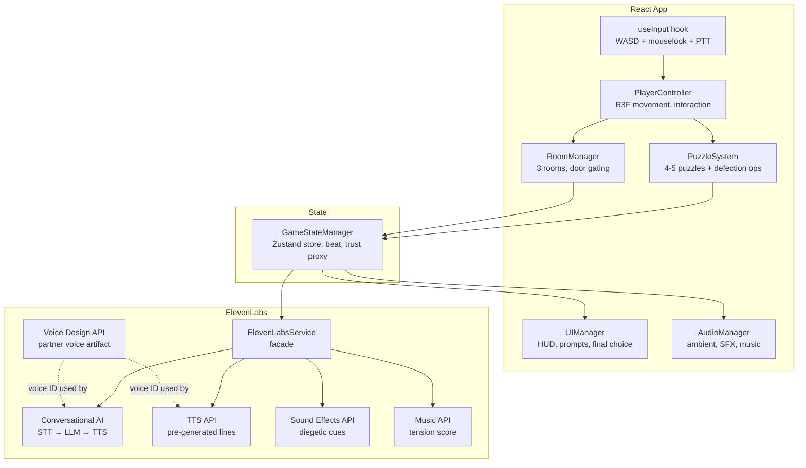

# Design Document: Static — AI Escape Room

## Overview

*Static* is a 3D first-person cooperative escape room game built for the Kiro × ElevenLabs Hackathon. The player is physically trapped in a locked industrial facility and must escape by communicating via push-to-talk voice with an AI partner on the other end of a walkie-talkie. Puzzles are interlocked — neither side can solve them alone. A hidden trust system tracks player behavior throughout the playthrough, culminating in a simultaneous prisoner's dilemma choice that determines one of four distinct endings.

### Design Goals

- **Communication as the core mechanic**: every puzzle requires verbal exchange; solo play is impossible by design.
- **Diegetic immersion**: all UI, audio, and latency are masked by in-world explanations (radio static, intercom, walkie-talkie).
- **Genuine AI agency**: the Partner's final cooperate/defect decision is reasoned, not scripted, driven by accumulated trust state.
- **Maximum ElevenLabs breadth**: Voice Design, Conversational AI, TTS, Sound Effects, and Music APIs all in active use.
- **2-day hackathon scope**: no original 3D modeling, no save system, single 10–15 min playthrough.

### Platform

Vite + React + TypeScript web application with Three.js and React Three Fiber for 3D rendering. Deployed as a static web build for easy judge access via browser. No desktop build required.

---

## Architecture

The game is structured as a set of loosely coupled React contexts and hooks that communicate through a central `GameStateManager`. All ElevenLabs API calls are routed through a single `ElevenLabsService` facade. React Three Fiber handles 3D rendering, and Zustand manages global state.



### Key Architectural Decisions

**Single ElevenLabsService facade**: All API calls go through one service class. This centralises error handling, retry logic, and API key management. It also makes it easy to swap in mock responses during development.

**Trust score lives in the Conversational AI agent**: The trust score is maintained as part of the agent's persistent memory/system prompt context — not in React state. React only knows the *outcome* (the final cooperate/defect choice). This keeps the trust reasoning opaque to the player and avoids synchronisation issues.

**Pre-generated audio assets**: All TTS narration, ending lines, and SFX are generated during the build process and shipped as static audio files. Only Conversational AI responses are streamed at runtime. This minimises runtime latency and API dependency during play.

**Narrative beats as a state machine**: The five beats (Opening → Rising → Midpoint → Climb → Climax) are modelled as a linear state machine in Zustand. Transitions are triggered by puzzle completion events. This drives audio escalation, UI changes, and partner tone shifts.

**Zustand for global state**: All game state (current beat, solved puzzles, room unlocks) lives in a single Zustand store. This provides simple subscription-based updates and easy persistence of session state in memory only (no localStorage/sessionStorage to avoid save behavior).

---

## Components and Interfaces

### useInput Hook

Handles all player input and routes it to the appropriate system.

```typescript
// hooks/useInput.ts
type InputEvents = {
  onMoveInput: Vector2
  onLookInput: Vector2
  onInteractPressed: () => void
  onPTTPressed: () => void
  onPTTReleased: () => void
  onFinalChoiceSelected: (choice: FinalChoice) => void
}

function useInput(events: InputEvents): void
```

### PlayerController

First-person movement and interaction raycast using React Three Fiber.

```typescript
// components/PlayerController.tsx
interface PlayerControllerProps {
  moveSpeed: number
  lookSensitivity: number
}

function PlayerController({ moveSpeed, lookSensitivity }: PlayerControllerProps): JSX.Element
  // Uses R3F useFrame for movement, useThree for camera
  // Raycast via drei <Raycaster> or custom raycasting
  // Exposes tryInteract() and setMovementEnabled()
```

### IInteractable (interface)

All interactable props implement this pattern.

```typescript
// types/interactable.ts
interface IInteractable {
  interact(player: PlayerController): void
  getPromptText(): string
  isInteractable: boolean
}
```

### useRoomManager Hook

Tracks which rooms are unlocked and manages door state.

```typescript
// hooks/useRoomManager.ts
interface RoomManagerState {
  rooms: Room[]
  currentRoomIndex: number
  tryUnlockDoor: (roomIndex: number) => boolean
  onDoorAttemptedWhileLocked: EventEmitter<void>
}

function useRoomManager(): RoomManagerState
```

### usePuzzleSystem Hook

Manages all puzzle instances and their state.

```typescript
// hooks/usePuzzleSystem.ts
interface PuzzleSystemState {
  puzzles: Map<string, IPuzzle>
  getPuzzle: (id: string) => IPuzzle | undefined
  onPuzzleSolved: EventEmitter<string>
  onPuzzleFailed: EventEmitter<string>
}

interface IPuzzle {
  puzzleId: string
  isDefectionOpportunity: boolean
  isSolved: boolean
  trySubmitSolution: (input: string) => boolean
  getPartnerKnowledge: () => string
}

function usePuzzleSystem(): PuzzleSystemState
```

### useGameStateStore (Zustand)

Central coordinator. Owns the narrative beat state machine.

```typescript
// stores/gameStateStore.ts
interface GameStateStore {
  currentBeat: NarrativeBeat
  solvedPuzzleCount: number
  advanceBeat: () => void
  onBeatChanged: EventEmitter<NarrativeBeat>
  onGameEnded: EventEmitter<EndingType>
  triggerMidGameReveal: () => void
  triggerFinalChoice: () => void
}

const useGameStateStore = create<GameStateStore>((set, get) => ({ ... }))
```

### ElevenLabsService

Facade over all ElevenLabs API calls.

```typescript
// services/elevenLabsService.ts
class ElevenLabsService {
  private apiKey: string
  private agentId: string
  private partnerVoiceId: string
  private conversationSession: ConvAISession | null

  async startConversationSession(): Promise<void>
  async sendPTTAudio(audioBlob: Blob): Promise<Blob>  // returns partner response
  async getFinalChoice(trustContext: string): Promise<FinalChoice>
  async playTTSLine(lineKey: string): Promise<Blob>   // from pre-generated cache
  onPartnerResponseReady: EventEmitter<Blob>
  onAPIError: EventEmitter<ElevenLabsError>
}
```

### TrustEventReporter

Thin wrapper that formats trust events as structured messages injected into the Conversational AI agent's context.

```typescript
// services/trustEventReporter.ts
type TrustEventType = 
  | 'LiedAboutPuzzle' 
  | 'WithheldInfo' 
  | 'SharedRiskyInfo'
  | 'CaughtInContradiction' 
  | 'VerbalReassurance' 
  | 'BrokePromise'

class TrustEventReporter {
  reportEvent(type: TrustEventType, detail: string): void
}
```

### useAudioManager Hook

Manages all audio layers: ambient, SFX, music, and partner voice.

```typescript
// hooks/useAudioManager.ts
interface AudioManager {
  playSFX: (key: SFXKey) => void
  setMusicBeat: (beat: NarrativeBeat) => void
  playPartnerResponse: (blob: Blob) => void
  playTTSLine: (blob: Blob) => void
  setIntercomActive: (active: boolean) => void
}

function useAudioManager(): AudioManager
```

### UIManager (React Components)

Manages all player-facing UI elements.

```typescript
// components/UIManager.tsx
function InteractionPrompt({ text }: { text: string }): JSX.Element
function PTTIndicator({ active }: { active: boolean }): JSX.Element
function SignalLostMessage(): JSX.Element
function FinalChoiceUI({ onChoice }: { onChoice: (c: FinalChoice) => void }): JSX.Element
function EndingScreen({ ending }: { ending: EndingType }): JSX.Element
function TitleScreen({ onStart }: { onStart: () => void }): JSX.Element
```

---

## Data Models

### NarrativeBeat (enum)

```typescript
// types/narrative.ts
enum NarrativeBeat {
  Opening = 'Opening',   // ~1 min: wake, first contact, tutorial puzzle
  Rising = 'Rising',     // ~4-5 min: puzzles 2-3, first defection opportunity
  Midpoint = 'Midpoint', // ~2-3 min: mid-game reveal, stakes change
  Climb = 'Climb',       // ~3-4 min: hardest puzzle, second defection opportunity
  Climax = 'Climax',     // ~2-3 min: final choice, ending
}
```

### FinalChoice (enum)

```typescript
// types/choices.ts
enum FinalChoice {
  Cooperate = 'Cooperate',
  Defect = 'Defect',
  Pending = 'Pending',
}
```

### EndingType (enum)

```typescript
// types/endings.ts
enum EndingType {
  Release = 'Release',      // both cooperate: AI revealed, both "escape"
  LeftBehind = 'LeftBehind', // player cooperates, AI defects: player trapped
  Alone = 'Alone',          // player defects, AI cooperates: player escapes, AI abandoned
  Reset = 'Reset',          // both defect: facility resets, cycle restarts
}
```

### TrustEventType (enum)

```typescript
// types/trust.ts
enum TrustEventType {
  LiedAboutPuzzle = 'LiedAboutPuzzle',        // -ve: player stated false info
  WithheldInfo = 'WithheldInfo',              // -ve: player ignored explicit request
  SharedRiskyInfo = 'SharedRiskyInfo',        // +ve: player revealed disadvantageous info
  CaughtInContradiction = 'CaughtInContradiction', // -ve: partner caught inconsistency
  VerbalReassurance = 'VerbalReassurance',    // +ve: emotional engagement or promise
  BrokePromise = 'BrokePromise',              // -ve: player broke earlier commitment
}
```

### PuzzleDefinition

```typescript
// types/puzzle.ts
interface PuzzleDefinition {
  id: string                        // e.g. "puzzle_01_symbol_correlation"
  archetype: PuzzleArchetype        // SymbolCorrelation | SplitCombination | DescriptiveMatch | ...
  isDefectionOpportunity: boolean
  playerSideProps: string[]         // prop IDs visible to player
  partnerKnowledge: string          // injected into agent system prompt
  correctSolution: string           // hashed; compared on submission
  roomId: string                    // which room this puzzle gates
  narrativeBeat: NarrativeBeat      // which beat this puzzle belongs to
}
```

### Room

```typescript
// types/room.ts
interface Room {
  id: string
  displayName: string
  props: Prop[]
  gatingPuzzleId: string            // puzzle that must be solved to enter next room
  isUnlocked: boolean
}
```

### Prop

```typescript
// types/prop.ts
interface Prop {
  id: string
  interactionPrompt: string
  revealContent: string             // text/symbol/number shown on interact
  isMidGameRevealProp: boolean
  puzzleId: string | null           // which puzzle this prop contributes to
}
```

### ConversationalAIAgentConfig

The system prompt / agent configuration injected at session start.

```typescript
// types/agentConfig.ts
interface ConversationalAIAgentConfig {
  systemPrompt: string              // partner persona, trust rules, decision rules
  initialMemory: string             // partner's "room" knowledge base
  voiceId: string                   // Voice Design artifact ID
  trustScoreInstructions: string    // how to update and use trust score
  finalChoiceInstructions: string   // decision rules for cooperate/defect
}
```

### ElevenLabsError

```typescript
// types/errors.ts
interface ElevenLabsError {
  apiName: 'ConversationalAI' | 'TTS' | 'SFX' | 'Music'
  statusCode: number
  message: string
  isRetryable: boolean
  assetKey: string | null           // for build-time pre-gen failures
}
```

### AudioAssetManifest

Pre-generated audio assets are catalogued in a manifest loaded at startup.

```typescript
// types/audio.ts
interface AudioAssetManifest {
  partnerVoiceId: string
  ttsLines: Map<string, string>     // key → URL to audio file
  sfxClips: Map<SFXKey, string>     // key → URL
  musicTracks: Map<NarrativeBeat, string>
  endingStings: Map<EndingType, string>
}
```

---

## Correctness Properties

*A property is a characteristic or behavior that should hold true across all valid executions of a system — essentially, a formal statement about what the system should do. Properties serve as the bridge between human-readable specifications and machine-verifiable correctness guarantees.*


### Property 1: Interaction prompt visibility

*For any* interactable prop and any player position, the interaction prompt should be visible if and only if the player is within the defined interaction range of that prop.

**Validates: Requirements 1.3**

---

### Property 2: Prop reveal on interact

*For any* interactable prop in its default (unrevealed) state, calling `Interact()` on it should result in the prop's puzzle-relevant content being accessible and non-empty.

**Validates: Requirements 1.4**

---

### Property 3: Door gating invariant

*For any* room transition, the door to the next room should be locked if and only if the gating puzzle for that transition is unsolved. Solving the puzzle should unlock the door; the door should never be unlocked while the puzzle remains unsolved.

**Validates: Requirements 1.5, 1.6, 11.3**

---

### Property 4: PTT audio filtering

*For any* sequence of PTT state changes (pressed/released) and audio frames, only audio frames captured during PTT-active periods should be forwarded to the Conversational AI pipeline. Frames captured while PTT is inactive should never be transmitted.

**Validates: Requirements 2.6**

---

### Property 5: Puzzle structural completeness

*For any* puzzle in the game's puzzle set, the puzzle should have non-empty `partnerKnowledge` (ensuring partner input is required), a valid non-empty `correctSolution`, and a valid `roomId` and `narrativeBeat` assignment.

**Validates: Requirements 5.1, 5.7**

---

### Property 6: Correct solution unlocks puzzle

*For any* puzzle, submitting the correct solution string should result in the puzzle transitioning to the solved state and the associated door/trigger being unlocked.

**Validates: Requirements 5.2**

---

### Property 7: Incorrect solution preserves puzzle state

*For any* puzzle and any solution string that does not match the correct solution, the puzzle should remain in the unsolved state and the player should be able to attempt again without any state penalty.

**Validates: Requirements 5.3**

---

### Property 8: Required puzzle archetypes present

*For any* valid game configuration, the puzzle set should contain at least one puzzle of each required archetype (SymbolCorrelation, SplitCombination, DescriptiveMatch) and exactly two puzzles with `isDefectionOpportunity = true`.

**Validates: Requirements 5.4, 5.5**

---

### Property 9: Defection opportunity puzzles are unverifiable by partner

*For any* puzzle with `isDefectionOpportunity = true`, the puzzle's `partnerKnowledge` field should not contain the correct solution string, ensuring the partner has no independent means of verification.

**Validates: Requirements 5.6**

---

### Property 10: Trust events are reported for player actions

*For any* player action that constitutes a trust event (lying during a defection opportunity, withholding requested info, sharing risky info, providing verbal reassurance), the corresponding `TrustEventType` should be reported to the agent via `TrustEventReporter`. Specifically:
- A lie during a defection opportunity → `LiedAboutPuzzle` event
- Ignoring an explicit partner request → `WithheldInfo` event
- Sharing risky information → `SharedRiskyInfo` event
- Verbal reassurance → `VerbalReassurance` event

**Validates: Requirements 6.2, 6.3, 6.4, 6.6**

---

### Property 11: Trust events accumulate across rooms without reset

*For any* sequence of trust events that spans multiple room transitions, all events should be present in the agent context after the room transition. The trust context should never be cleared or reset between rooms.

**Validates: Requirements 6.9**

---

### Property 12: Mid-game reveal prop placement

*For any* valid game configuration, there should exist exactly one prop with `isMidGameRevealProp = true`, and that prop should be located in room 2 or room 3 (not room 1).

**Validates: Requirements 7.1**

---

### Property 13: Mid-game reveal triggers partner reaction

*For any* game session, interacting with the mid-game reveal prop should trigger a ConvAI response request and audio playback via the intercom. The partner reaction should occur before the player can proceed.

**Validates: Requirements 7.2**

---

### Property 14: Final choice routing correctness

*For any* combination of player choice (Cooperate/Defect) and partner choice (Cooperate/Defect), the game should route to exactly the correct ending per the 2×2 matrix:
- (Cooperate, Cooperate) → `Release`
- (Cooperate, Defect) → `LeftBehind`
- (Defect, Cooperate) → `Alone`
- (Defect, Defect) → `Reset`

**Validates: Requirements 8.6, 9.1**

---

### Property 15: Both choices collected before reveal

*For any* final choice sequence, the ending screen should only be displayed after both the player's choice and the partner's choice have been received. The ending should never be shown with only one choice collected.

**Validates: Requirements 8.3, 8.5**

---

### Property 16: Narrative beat advances monotonically

*For any* sequence of puzzle completion events, the current narrative beat should only ever advance forward (Opening → Rising → Midpoint → Climb → Climax) and should never regress to a prior beat. The beat should always be a valid `NarrativeBeat` value.

**Validates: Requirements 11.1, 11.2**

---

### Property 17: Audio state matches narrative beat

*For any* narrative beat, the audio manager's music volume and ambient layer configuration should match the expected state for that beat. Specifically: music should be absent or near-zero during Opening/Rising, introduced at low volume at Midpoint, increased at Climb, and at full tension during Climax.

**Validates: Requirements 12.3, 12.4, 12.5, 12.6**

---

## Error Handling

### ElevenLabs API Failures

All ElevenLabs API calls are routed through `ElevenLabsService`, which implements a consistent error handling strategy:

**Conversational AI (runtime)**
- Timeout after 10 seconds → play static-burst SFX, show "signal lost" UI message, retry once
- Second failure → surface error state, allow player to retry PTT manually
- Session disconnect → attempt session reconnect before surfacing error

**TTS / SFX / Music (pre-generated, build time)**
- Any pre-generation failure → surface a build error identifying the failed asset key
- The build should not be considered complete until all pre-generated assets are present in the `AudioAssetManifest`
- Failed assets are identified by their manifest key so they can be individually regenerated

**Voice Design (build time)**
- Voice ID must be set in `ConversationalAIAgentConfig` before build finalisation
- If voice ID is missing or invalid, the build process should fail with a clear error

### Microphone Unavailability

- On PTT press, if microphone permission is denied or device is unavailable → display error message in HUD, activate text-input fallback field
- Text input fallback sends typed text directly to the ConvAI pipeline as a text turn (bypassing STT)

### Puzzle Submission Errors

- Incorrect solution → play failure SFX + visual flash, puzzle state unchanged, player can retry immediately
- No penalty for incorrect attempts; the game does not track attempt count

### Door Interaction While Locked

- Player attempts to open locked door → play locked-door audio cue (from pre-generated SFX), no state change
- No error message; the audio cue is the diegetic feedback

### Session State

- No save system; if the application is closed mid-session, all state is lost
- On next launch, a fresh playthrough begins from the title screen
- The ConvAI session is terminated on application close; no session ID is persisted

---

## Testing Strategy

### Dual Testing Approach

Testing combines unit/example-based tests for specific scenarios with property-based tests for universal invariants.

**Unit / Example Tests** cover:
- Specific UI states (PTT indicator, final choice UI, ending screens)
- API call verification (correct voice ID, trust context included, correct API called for each purpose)
- Error handling scenarios (API timeout, mic unavailable, incorrect puzzle solution)
- Configuration invariants (system prompt contains decision rules, no save operations)

**Property-Based Tests** cover:
- Universal invariants that should hold across all valid inputs (door gating, puzzle state transitions, trust event reporting, beat advancement, audio state, final choice routing)
- Edge cases are covered by the property generators (empty strings, boundary values, all choice combinations)

### Property-Based Testing Library

**Vite + React + TypeScript:** [fast-check](https://fast-check.dev/).

Each property test runs a minimum of **100 iterations**.

Each property test is tagged with a comment referencing the design property:

```typescript
// Feature: ai-escape-room, Property 3: Door gating invariant
// For any room transition, the door should be locked iff the gating puzzle is unsolved
fc.assert(fc.property(/* generators */, (/* args */) => {
  // test body
}))
```

### Test Coverage Map

| Design Property | Test Type | Key Scenario |
|---|---|---|
| P1: Interaction prompt visibility | Property | Player position vs. prop range |
| P2: Prop reveal on interact | Property | Any interactable prop |
| P3: Door gating invariant | Property | Solved/unsolved puzzle → door state |
| P4: PTT audio filtering | Property | PTT state sequences + audio frames |
| P5: Puzzle structural completeness | Property | All puzzle definitions |
| P6: Correct solution unlocks puzzle | Property | Any puzzle + correct solution |
| P7: Incorrect solution preserves state | Property | Any puzzle + wrong solution |
| P8: Required archetypes present | Property | Puzzle set composition |
| P9: Defection puzzles unverifiable | Property | All defection opportunity puzzles |
| P10: Trust events reported | Property | All trust event types |
| P11: Trust accumulates across rooms | Property | Multi-room event sequences |
| P12: Mid-game reveal placement | Property | Room configuration |
| P13: Mid-game reveal triggers reaction | Property | Reveal prop interaction |
| P14: Final choice routing | Property | All 4 choice combinations |
| P15: Both choices before reveal | Property | Choice collection sequencing |
| P16: Beat advances monotonically | Property | Puzzle completion sequences |
| P17: Audio matches beat | Property | All narrative beats |
| API call verification | Integration | ElevenLabsService with mocked SDK |
| Error handling (timeout, mic) | Example | Mocked failure scenarios |
| UI state (PTT indicator, final choice) | Example | Specific UI states |
| Ending content (audio, screen) | Example | Each of 4 endings |
| No save operations | Example | Full session simulation |

### Integration Tests

Integration tests use a mocked `ElevenLabsService` to verify:
- The correct API is called for each purpose (ConvAI for runtime dialogue, TTS for pre-generated lines, SFX for diegetic cues, Music for tension score)
- The ConvAI session is initialised with the correct voice ID and system prompt
- The `GetFinalChoice` call includes conversation history and trust context
- API errors are handled with the correct fallback behaviour

### Manual Playtesting

The following requirements require manual verification:
- Partner stays in character throughout the playthrough (Req 3.7)
- Partner tone shifts toward wariness at low trust (Req 6.8)
- Partner contextual reasoning at mid-range trust (Req 8.9)
- Voice Design output matches target profile (Req 4.1–4.4)
- Mid-game reveal ambiguity is preserved (Req 7.4)
- Each ending delivers the intended emotional experience (Req 9.1–9.7)
- Audio atmosphere reinforces psychological thriller tone (Req 12.1–12.2, 12.8)
